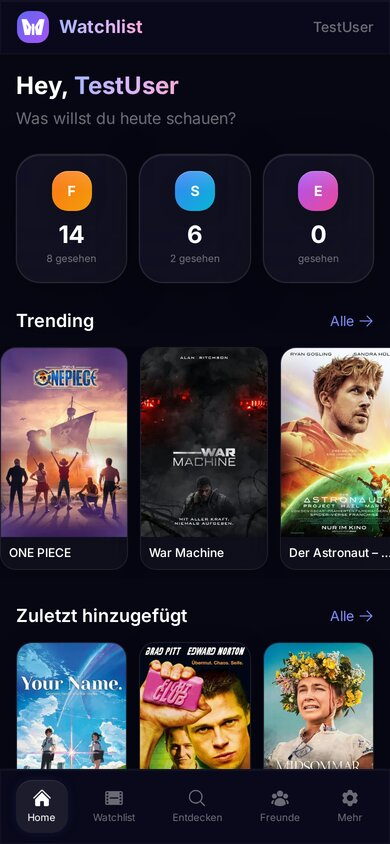
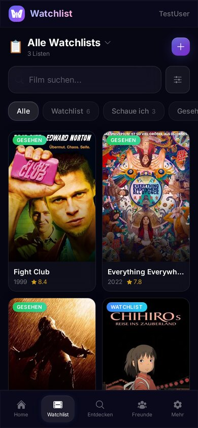
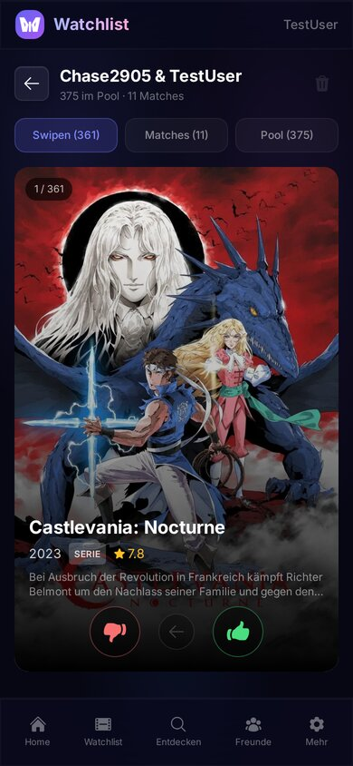
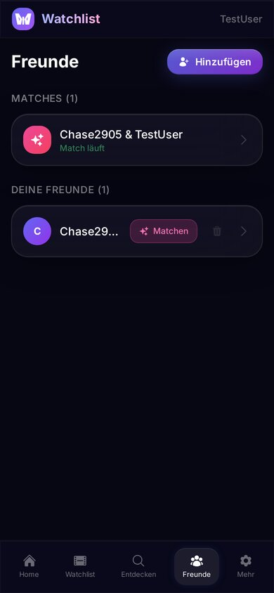
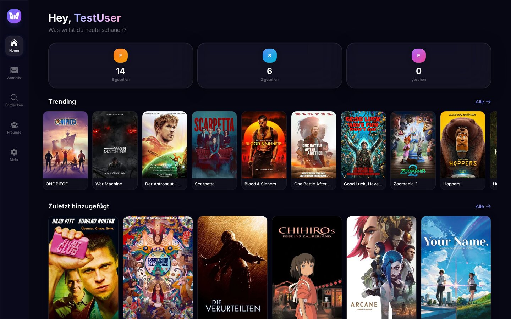
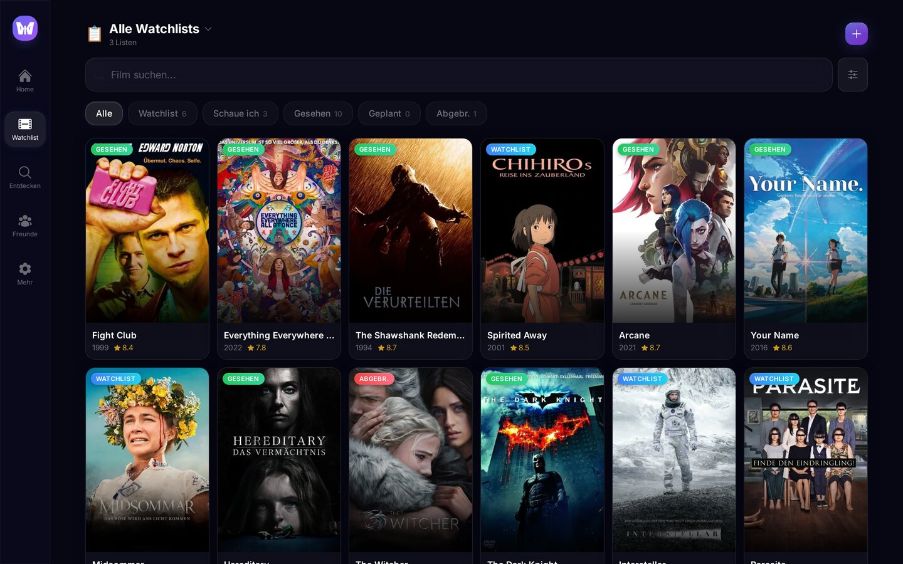

<p align="center">
  
</p>

<h1 align="center">Watchlist</h1>

<p align="center">
  <strong>Deine Film & Serien Watchlist &mdash; mit Freunden matchen, Medienserver verwalten, alles an einem Ort.</strong>
</p>

<p align="center">
  
  
  
  
  
  
</p>

---

<p align="center">
  &nbsp;
  &nbsp;
  &nbsp;
  
</p>

<p align="center">
  
</p>

<p align="center">
  
</p>

---

## Features

### Watchlist-Management
- Mehrere Watchlists mit Sichtbarkeit (Freunde / Privat)
- Status-Tracking: Watchlist, Schaue ich, Gesehen, Geplant, Abgebrochen
- Filter, Sortierung, Tags, Bewertungen
- TMDB-Integration (Suche, Trending, Details, Genres, Poster)

### Tinder-Style Matching
- Freunde einladen, gemeinsam Watchlists in den Pool werfen
- Lobby: Beide stellen ihren Pool zusammen, markieren sich als bereit
- Swipe links/rechts (Touch, Maus-Drag, Pfeiltasten)
- Gemeinsame Matches ansehen, Details checken, als gesehen markieren

### Medienserver-Integration
- **Plex** &mdash; OAuth-Login, Server Auto-Discovery, Watch-Status-Sync, Staffelfortschritt, Audio/Untertitel-Sprachen
- **Jellyfin** &mdash; Login, Serververwaltung, bidirektionaler Sync, automatischer Token-Refresh
- **Sonarr** &mdash; Serien verwalten, Episoden browsen, manuelle Release-Suche, Downloads, Queue
- **Radarr** &mdash; Filme verwalten, Release-Suche, Downloads, Queue
- **Tautulli** &mdash; Watch-History importieren

### Cross-Sync
- Automatisch: Plex &harr; App &harr; Jellyfin (alle 5 Minuten)
- Nightly Full-Sync um 3:00 Uhr fuer alle User
- Manueller Vollsync jederzeit ueber Einstellungen

### Weiteres
- Freundschaftssystem mit Watchlist-Sharing
- MCP-Server (21 Tools, HTTP + SSE, OAuth + API-Key)
- Admin-Panel (User-Verwaltung, Download-Profile, verschluesselter Config-Export)
- PWA-fhig (auf Homescreen installierbar)
- Mobile-First Glassmorphism UI

---

## Quick Start

### 1. Klonen

```bash
git clone https://github.com/YOUR_USER/watchlist.git
cd watchlist
```

### 2. Konfigurieren

```bash
cp .env.example .env
nano .env
```

Mindestens diese Werte setzen:

| Variable | Beschreibung | Wo bekomme ich das? |
|---|---|---|
| `TMDB_API_KEY` | TMDB API Key | [themoviedb.org/settings/api](https://www.themoviedb.org/settings/api) (kostenlos) |
| `TMDB_ACCESS_TOKEN` | TMDB Read Access Token | Gleiche Seite |
| `JWT_SECRET` | Zufallsstring | `openssl rand -hex 32` |

### 3. Starten

```bash
docker compose up -d --build
```

Fertig. Die App laeuft auf **http://localhost:5173**

### 4. Erster Login

| Methode | Ablauf |
|---|---|
| **Plex** | Klick auf "Mit Plex anmelden". Der erste Plex-User wird automatisch Admin. Server werden automatisch erkannt. |
| **Jellyfin** | Admin setzt unter Einstellungen die Jellyfin-Server-URL. Danach koennen sich Jellyfin-User einloggen. |

Nach dem ersten Login werden automatisch alle Plex-Server entdeckt und ein Full-Sync gestartet.

---

## MCP-Server (Model Context Protocol)

Die App hat einen eingebauten MCP-Server mit **21 Tools**, den du direkt in Claude, ChatGPT oder anderen MCP-faehigen Clients nutzen kannst.

### Transports

| Transport | URL | Beschreibung |
|---|---|---|
| **HTTP** (Streamable) | `https://deine-domain.de/mcp` | Standard MCP via HTTP POST |
| **SSE** | `https://deine-domain.de/sse` | Server-Sent Events Stream |

### Authentifizierung

**API Key** (empfohlen): Erstelle einen Key unter Einstellungen &rarr; API Keys. Uebergib ihn als Bearer Token oder Query-Parameter:

```
Authorization: Bearer dein-api-key
# oder
https://deine-domain.de/mcp?key=dein-api-key
```

**OAuth 2.0**: Plex-basierter OAuth Flow fuer Browser-Clients (z.B. Claude Pro).

### Claude Desktop / Claude Code Konfiguration

```json
{
  "mcpServers": {
    "watchlist": {
      "url": "https://deine-domain.de/mcp?key=DEIN_API_KEY"
    }
  }
}
```

### Verfuegbare Tools (21)

| Tool | Beschreibung |
|---|---|
| `search_movie` | Film/Serie auf TMDB suchen |
| `get_movie_details` | Details zu einem TMDB-Eintrag |
| `get_trending` | Aktuelle Trending-Filme/Serien |
| `add_to_watchlist` | Zur Watchlist hinzufuegen |
| `remove_from_watchlist` | Von Watchlist entfernen |
| `update_status` | Status aendern (watching/watched/etc.) |
| `get_watchlist` | Eigene Watchlist abrufen |
| `get_friends_watchlist` | Watchlist eines Freundes |
| `get_recommendations` | Empfehlungen basierend auf Watchlist |
| `check_plex_status` | Ist ein Titel auf Plex verfuegbar? |
| `check_jellyfin_status` | Ist ein Titel auf Jellyfin verfuegbar? |
| `check_sonarr_status` | Serie auf Sonarr pruefen |
| `check_radarr_status` | Film auf Radarr pruefen |
| `add_to_sonarr` | Serie zu Sonarr hinzufuegen |
| `add_to_radarr` | Film zu Radarr hinzufuegen |
| `delete_from_sonarr` | Serie von Sonarr entfernen |
| `delete_from_radarr` | Film von Radarr entfernen |
| `search_releases` | Verfuegbare Releases suchen |
| `grab_release` | Release herunterladen |
| `get_stats` | Watchlist-Statistiken |
| `get_calendar` | Kommende Episoden (Sonarr-Kalender) |

---

## Tech Stack

| Komponente | Technologie |
|---|---|
| Backend | FastAPI, Python 3.12, SQLAlchemy Async, Pydantic |
| Frontend | React 18, Vite, Tailwind CSS |
| Datenbank | PostgreSQL 16 |
| Deployment | Docker Compose (3 Container: DB, Backend, Frontend/Nginx) |
| Auth | JWT (30 Tage), Plex OAuth, Jellyfin Auth |

## API Docs

Swagger UI: `http://localhost:8000/docs`

### Endpoints

| Bereich | Prefix | Beschreibung |
|---|---|---|
| Auth | `/api/auth` | Login (Plex/Jellyfin/Local), Token |
| Watchlist | `/api/watchlist` | Listen, Filme, Sharing, Export/Import |
| Freunde | `/api/friends` | Anfragen, Liste, Level |
| Matches | `/api/match` | Lobby, Pool, Swiping, Ergebnisse |
| Medien | `/api/media` | TMDB Suche, Trending, Details, Sprachen |
| Plex | `/api/plex` | Server, Status, Sync, Scrobble |
| Jellyfin | `/api/jellyfin` | Server, Status, Sync |
| Sonarr | `/api/sonarr` | Serien, Episoden, Releases, Queue |
| Radarr | `/api/radarr` | Filme, Releases, Queue |
| Tautulli | `/api/tautulli` | Server, History-Sync |
| Admin | `/api/admin` | Users, Profiles, Config Export/Import |
| MCP | `/mcp`, `/sse` | Model Context Protocol (21 Tools) |
| Sync | `/api/sync` | Sync-Dashboard, Full-Sync Trigger |

## Projektstruktur

```
watchlist/
├── backend/
│   ├── app/
│   │   ├── main.py            # App, Lifespan, 5 Background-Sync-Loops
│   │   ├── models.py          # 20+ SQLAlchemy Models
│   │   ├── auth.py            # JWT, bcrypt, Plex/Jellyfin Auth
│   │   ├── routers/           # 14 API-Router
│   │   └── services/          # Plex, Jellyfin, Sonarr, Radarr, TMDB, Tautulli
│   ├── requirements.txt
│   └── Dockerfile
├── frontend/
│   ├── src/
│   │   ├── pages/             # Dashboard, Watchlist, Discover, Friends, Match, Settings, Login
│   │   ├── components/        # MovieCard, MovieDetailModal, SonarrStatus, WatchProviders, ...
│   │   ├── context/           # AuthContext
│   │   └── api/               # Axios Client mit 401-Interceptor
│   ├── public/                # App Icons, Manifest
│   ├── nginx.conf             # Production Reverse Proxy + Cache Headers
│   └── Dockerfile
├── docker-compose.yml
├── .env.example
└── docs/                      # Screenshots
```

## Entwicklung (ohne Docker)

```bash
# Backend
cd backend
python3 -m venv .venv && source .venv/bin/activate
pip install -r requirements.txt
uvicorn app.main:app --reload --port 8000

# Frontend (eigenes Terminal)
cd frontend
npm install
npm run dev
# Vite-Proxy leitet /api/* automatisch an :8000 weiter
```

## Lizenz

MIT
